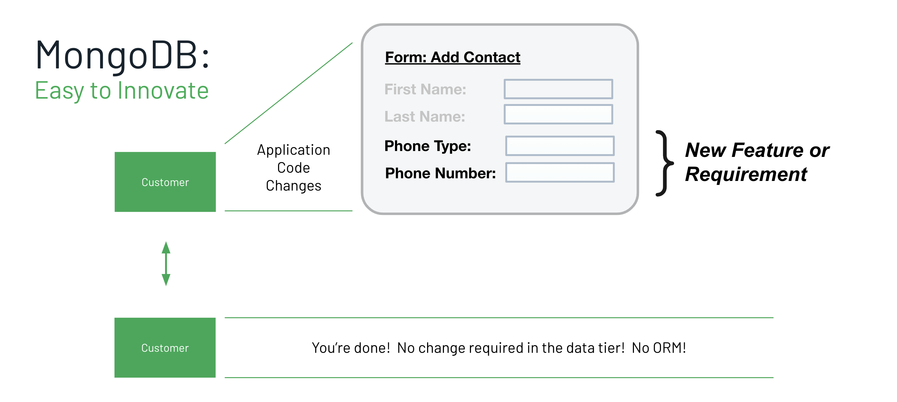
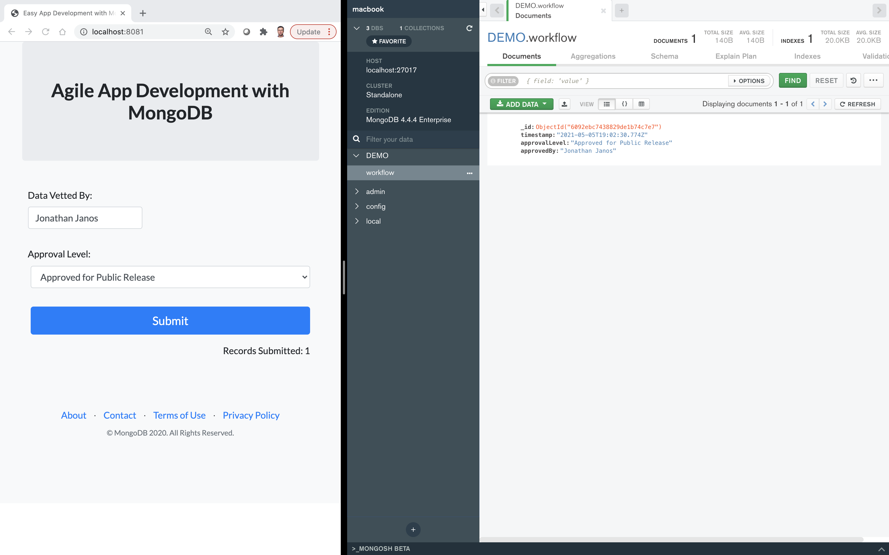
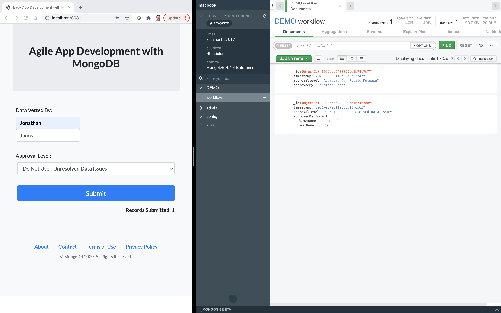

# Your basic Node.js web application built on MongoDB

Here is a very simple web "application" (just a form, really) that illustrates one of the key benefits of using MongoDB: the ability to iterate rapidly and build great apps faster. The scneario is immaterial, but if you want one, let's say you're collecting data from a variety of sources and you want to then make it available to anyone who wants it. But before you do that, you want a data steward to take a look at it and sign off on it, verifying that it's suitable (or not) for public consumption. It's a very simple (but not unreasonable) requirement, and your lead developer decides to implement this as a simple Node.js web application (also immaterial, as MongoDB supports a dozen different languages). The point of the demo is to show how your developers can build their apps immediately, without first designing a database schema in advance, and can then make iterative changes to their application without constantly going back to the database or their DBAs to make schema modifications (as would be required by any relational database). 

**Step 1:** Just launch this simple web form, fill in the fields, and click the Submit button. Note how the record looks in MongoDB (you can use MongoDB Compass side-by-side with the web form), and note that the collection did not exist until the first record was written.

**Step 2:** At this point, the developer is pleased with how easy it was to get the initial capability up and running, but now starts to think that it would be better to have two separate fields to capture the user's first and last names. So they modify the web form with the additional field, reload the web page, fill in the form, and click Submit once again. Presto! The new JSON document will have the new data model. And yet, unlike with simple key-value stores, all fields are instantly queryable (you could, for example, query on approvedBy.lastName). You can create secondary indexes, build data pipelines, run analytics, etc. Using Compass, you could also demonstrate JSON Schema validation at this point, as one way to address possible concerns about inconsistent/erroneous data models (e.g. require approvedBy.lastName).

**Setup:** Node.js and NPM have to be installed. Then, from the <em>code</em> directory, run "npm install" to install the dependencies defined in <em>package.json</em>. In <em>index.js</em>, modify the MongoDB connect string to connect to your database. Passwords can be put in the key.json file. Run the app with "node index.js". The web form is in <em>index.html</em>. The 2 required code changes to get from v1 of the form to v2 are clearly commented in the code - just make these changes on-the-fly in the demo using your favorite code editor, save the changes, and then reload the form in your web browser. Backup versions of both v1 and v2 forms are only there in case you ever forget to undo your work at the end of the demo.

**Credits:** This demo is a stripped-down version of a demo developed by Matt Groghan ([here](https://github.com/mdg-2018/30-min-data-web-form)), which itself was a node.js adaptation of a MongoDB Atlas demo created by Michael Lynn ([here](https://github.com/mrlynn/30-min-data-web-form)).

